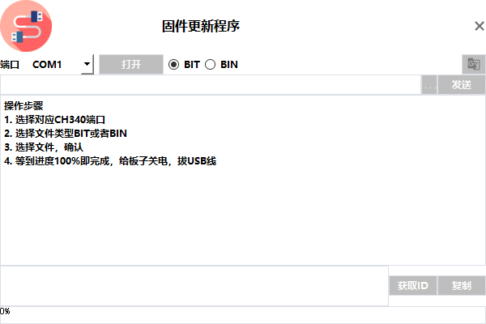

# D60 Upscaling Fuser Guide

The **Dichen D60 4K Fuser** (aka Dichen p1) allows a **Main PC** (DisplayPort 1.4) and an **Overlay PC** (HDMI 2.1) to feed separate signals that are fused together. This guide covers some resolution tips, firmware upgrades and other stuff

---

## 1. System Overview

**Inputs:**
- **Main PC** → DisplayPort 1.4  
- **Overlay PC** → HDMI 2.1  

**Output:**  
- Combined fused signal to your display.

---

## 2. Supported Resolutions & Refresh Rates

The D60 supports high refresh rates on the main DP 1.4 input. Some combinations **may only be possible at 6 bits per color (6 bpc)** due to DP 1.4 bandwidth limits.

| Resolution / Refresh (Main)   | Notes |
|--------------------------------|-------|
| **3840×2160 @ 120 Hz** (4K120) | May require **6 bpc** or DSC |
| **2560×1440 @ 240 Hz** (QHD240)| May require **6 bpc** |
| **1920×1080 @ 360 Hz** (1080p360) | May require **6 bpc** |

---

## 3. Overlay Resolution Rules

- **Overlay HDMI resolution should ideally be exactly half** the main PC resolution in each dimension for perfect 2:1 scaling.
- Examples:
  - Main: 3840×2160 → Overlay: 1920×1080
  - Main: 2560×1440 → Overlay: 1280×720
  - Main: 1920×1080 → Overlay: 960×540 (or 1280×720 for convenience)
- The D60 **upscales** the overlay to match the main resolution.

---

## 4. HDMI 2.1 Requirement (Overlay)

The overlay input **must** be HDMI 2.1.  
- Many mini PCs only have **HDMI 2.0** on Intel iGPUs — these are **not** sufficient.
- Use a **discrete NVIDIA or AMD GPU** to ensure HDMI 2.1 support.
- If you must use Intel, a **true HDMI 2.1 adapter** is required (verify FRL support).

---

## 5. Setting Resolutions

### Windows Settings (Main PC)
1. **Settings → System → Display → Advanced display**
2. Select the D60 output.
3. Set desired **resolution** and **refresh rate**.

### NVIDIA Control Panel
1. Right-click desktop → **NVIDIA Control Panel**.
2. **Change resolution** → Select D60 output.
3. Adjust **color format**, **color depth** (try 6 bpc if needed), and **refresh rate**.
4. Use **Custom Resolution** if mode is missing.

### AMD Software
1. Open **AMD Software** → **Settings → Display**.
2. Create custom resolutions if needed.
3. Adjust **Pixel Format** and **Color Depth**.

---

## 6. Bandwidth & Stability Tips
- Use **short, certified** DP 1.4 and HDMI 2.1 cables.
- If a mode fails:
  1. Lower bit depth (**6 bpc** if possible)
  2. Reduce chroma (YCbCr 4:2:2 or 4:2:0)
  3. Disable HDR
  4. Enable DSC if supported

---

## 7. Firmware Upgrade — Dichen 4K Fuser (D60)

> ⚠️ **Important:** Only upgrade with the **official package** from Dichen to avoid bricking your device (check releases in this repo)
> Also do this on your overlay PC 

### Step 1 — Enter Upgrade Mode
1. Connect D60 to **power** and the **USB-C port** on your PC.
2. Hold the **power button** on the back and the **small button under “D60”** on the front at the same time.
3. The **lower-left indicator light** will stay **red** — this means you’re in upgrade mode.

### Step 2 — Prepare the Upgrade Package
- Download the correct **BIN firmware file** from official sources.
- Keep it in an accessible location on your PC.

### Step 3 — Load the Firmware
1. Open the official Dichen firmware tool.
2. Select the correct COM port (e.g., `COM3` in Windows Device Manager).
3. Set file type to **BIN**.
4. Click the `...` button, browse to the firmware file, and select **Open**.

### Step 4 — Send the Firmware
1. Click **Send** in the firmware tool.
2. The D60 indicator will turn **green** during transfer.
3. Wait until you see **"Send Complete"** in the status bar.
4. **Do not disconnect power** during the process.

### Step 5 — Finish
1. Power off the D60 after completion.
2. Firmware upgrade is done.

---

## 8. Quick Checklist
- [ ] Main PC on DP 1.4
- [ ] Overlay PC on HDMI 2.1
- [ ] Overlay resolution = half of main
- [ ] Use 6 bpc for high-refresh stability
- [ ] Use certified cables
- [ ] Follow official firmware upgrade steps exactly
